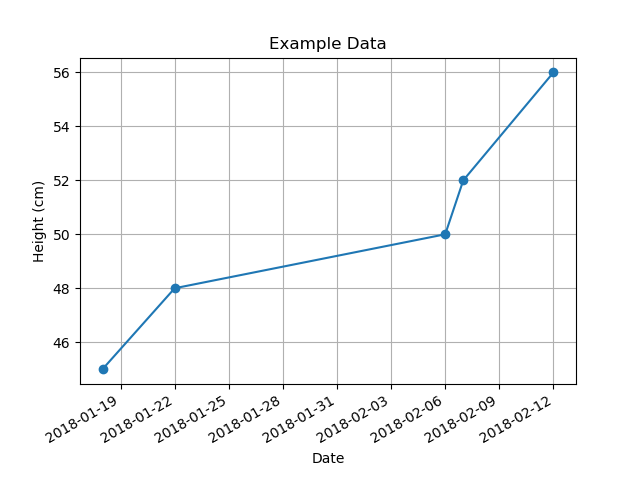

Scatter Plot by Date
====================

A commmand-line program to create a scatter-plot from an input csv
data file, where the independent variable (x-axis) is expressed in
dates like 2018-04-15.

Prerequisites
=============

You'll need to have Python v3 installed, plus the matplotlib library.
To install matplotlib, use your OS's package manager; on Debian,
that's:

    apt install python3-matplotlib

CSV Input File
==============

X-axis (date) data goes in the first column (and must be formatted
like YYYY-MM-DD). Y-axis data in the second column. The titles for the
plot's axes will come from the first row of the csv.

For example:

~~~
Date,Height (cm)
2018-01-18,45
2018-01-22,48
2018-02-06,50
2018-02-07,52
2018-02-12,56
~~~

would produce:

Running It
==========

Run it like so:

    scatter-plot-by-date.py 'My Plot Title' input.csv

This will cause a window to pop up containing your plot. You'll
usually then click the nostalgic floppy disk icon to save your plot to
a file.
